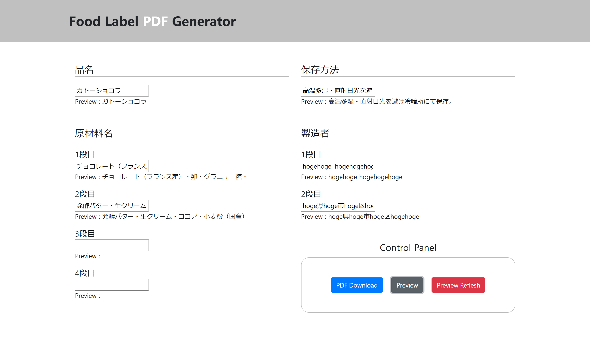
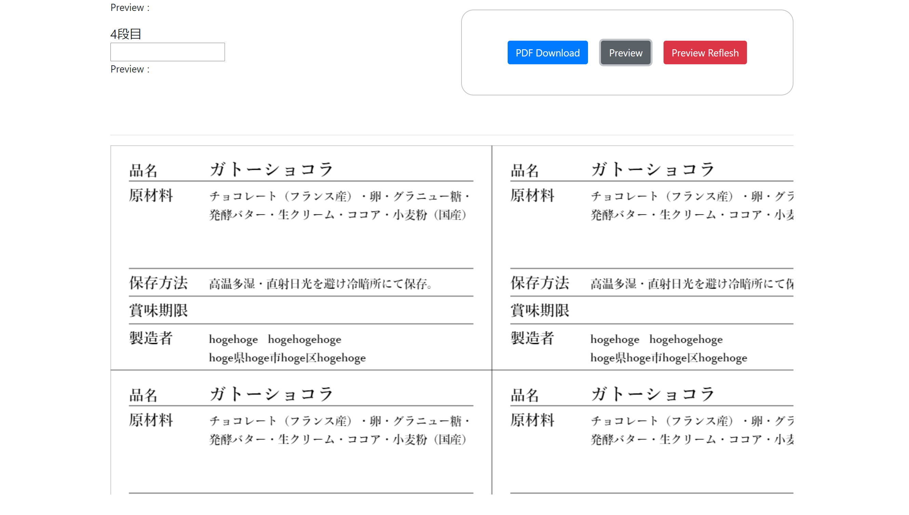
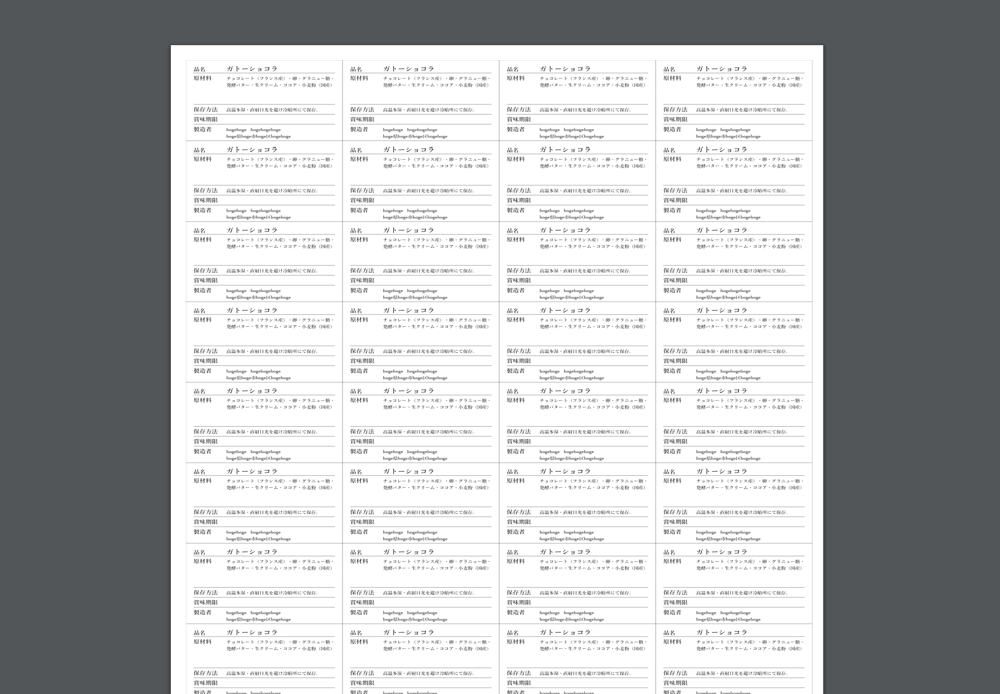

# Food Label PDF Generator

### 入力画面
enter the info. Food Label PDF Generator is intended to use food label making.



### プレビュー
click "Previw". You can previw pdf label output image.



### PDF
click "Download". You can download pdf file.




## Build Setup

```bash
# install dependencies
$ npm install

# serve with hot reload at localhost:3000
$ npm run dev

# build for production and launch server
$ npm run build
$ npm run start

# generate static project
$ npm run generate
```

For detailed explanation on how things work, check out [Nuxt.js docs](https://nuxtjs.org).
